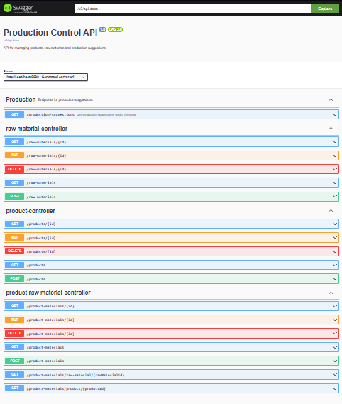
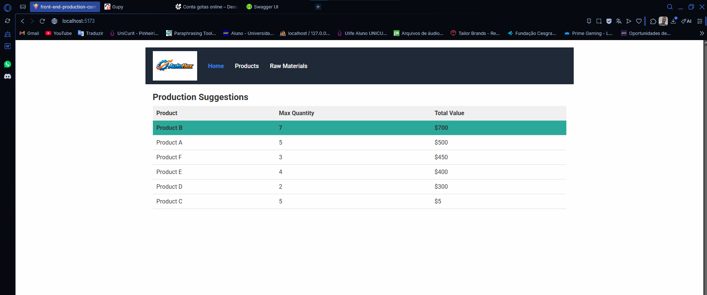
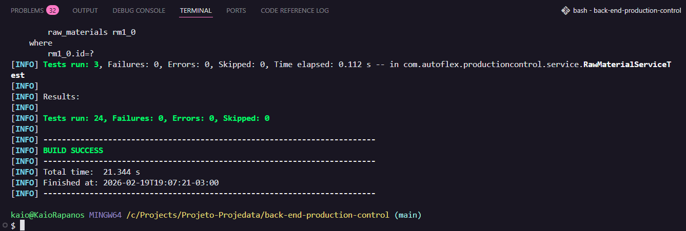

# 🏭 Production Control System

Sistema web full-stack desenvolvido para gerenciar a produção industrial com base na disponibilidade de matérias-primas em estoque.

O sistema controla produtos, matérias-primas e calcula sugestões de produção priorizando os produtos de maior valor para maximizar a receita.

Construído seguindo arquitetura REST API, com separação clara entre back-end e front-end.

---

# 📸 Visualização da Aplicação

## Swagger API

<p align="center">
  
</p>

---

## Interface da Aplicação

<p align="center">
  
</p>

---

## Resultado dos Testes Unitários

<p align="center">
  
</p>

---

# 📌 Visão Geral

Indústrias frequentemente enfrentam desafios no controle de estoque de matérias-primas e na decisão de quais produtos devem ser produzidos com base na disponibilidade.

Este sistema:

✔ Controla estoque de matérias-primas  
✔ Gerencia composição de produtos  
✔ Calcula quantidade máxima produzível  
✔ Prioriza produtos de maior valor  
✔ Estima valor total da produção  

---

# 🏗 Arquitetura

O sistema segue o padrão de arquitetura em camadas:

## Back-end (Spring Boot API)

- Camada Controller  
- Camada Service (Regras de Negócio)  
- Camada Repository (Persistência)  
- Banco de Dados PostgreSQL  

## Front-end (React)

- Arquitetura baseada em componentes  
- Consumo de API via Axios  
- Interface responsiva utilizando CSS Modules  

A comunicação é realizada via endpoints REST em formato JSON.

---

# 🧠 Regra de Negócio

A lógica principal calcula a produção máxima possível com base no estoque disponível.

Para cada produto:

1. O sistema verifica as matérias-primas necessárias.
2. Calcula quantas unidades podem ser produzidas com base em cada matéria-prima.
3. O menor valor encontrado define o limite de produção.
4. Os produtos são ordenados por maior valor.
5. O sistema prioriza os mais lucrativos.
6. Retorna o valor total estimado da produção.

Isso simula uma estratégia simplificada de planejamento industrial.

---

# 📦 Funcionalidades

## Gestão de Produtos (CRUD)

- Criar produto  
- Atualizar produto  
- Remover produto  
- Listar produtos  

## Gestão de Matérias-Primas (CRUD)

- Criar matéria-prima  
- Atualizar matéria-prima  
- Remover matéria-prima  
- Listar matérias-primas  

## Composição de Produtos

- Associar matérias-primas aos produtos  
- Definir quantidade necessária por produto  

## Motor de Sugestão de Produção

- Identifica produtos que podem ser produzidos  
- Calcula quantidade máxima de produção  
- Ordena por maior valor  
- Destaca produto mais lucrativo  
- Calcula receita total estimada  

---

# 🗄 Modelagem de Banco de Dados

Principais entidades:

- Product  
- RawMaterial  
- ProductRawMaterial (Entidade de Associação)

Relacionamento:

Product ↔ RawMaterial (Muitos-para-Muitos com controle de quantidade)

A tabela intermediária armazena a quantidade necessária de cada matéria-prima por produto.

---

# 🧪 Testes

Back-end:

- Testes unitários na camada de serviço  
- Validação das regras de negócio  

O sistema garante:

✔ Cálculo correto de produção  
✔ Ordenação adequada por valor  
✔ Cálculo preciso do valor total  

---

# 💻 Tecnologias Utilizadas

## Back-end

- Java  
- Spring Boot  
- Spring Data JPA  
- Hibernate  
- PostgreSQL  
- Maven  
- JUnit  

## Front-end

- React  
- JavaScript / TypeScript  
- Axios  
- CSS Modules  

---

# 📱 Responsividade

Interface totalmente responsiva e compatível com:

- Chrome  
- Firefox  
- Edge  

---

# ▶️ Como Executar o Projeto

## Back-end

```bash
cd back-end-production-control
mvn spring-boot:run
```

## Front-end

```bash
cd front-end-production-control
npm install
npm run dev
```
